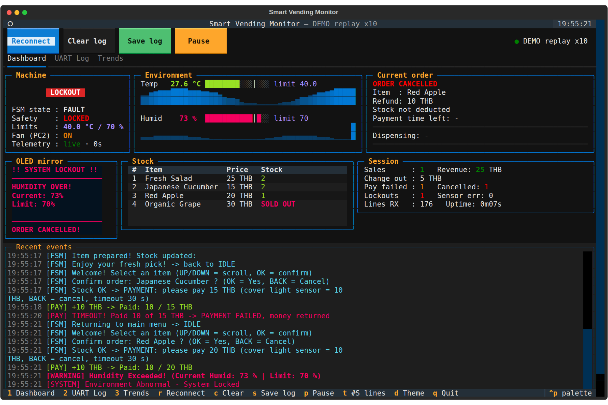
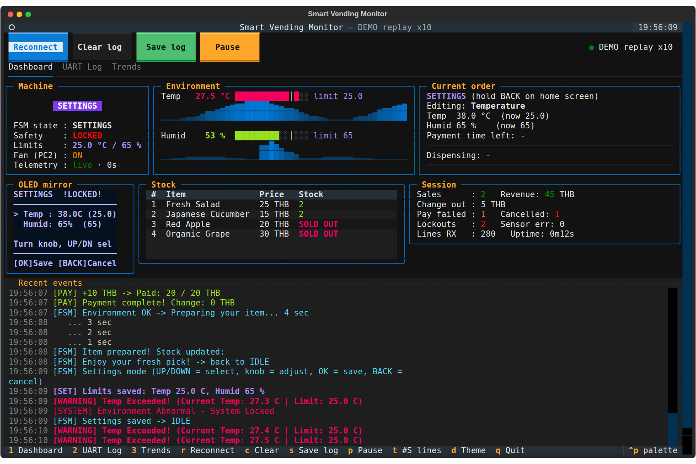

# 🥦 Smart Vegetable Vending Machine (STM32F411)

A modular, production-grade embedded control system for an automated vegetable vending machine featuring integrated freshness preservation and remote telemetry monitoring. Developed for the **STM32F411** microcontroller using custom bare-metal register-level drivers.

---

## 📌 Key System Features
- **Bare-Metal Drivers:** Custom register-level drivers for GPIO, I2C, UART, ADC, EXTI, TIM2, and IWDG without reliance on heavy HAL boilerplate.
- **Layered Architecture:** Clear decoupling between hardware abstraction layers (`Drivers/`) and high-level application logic (`App/`).
- **Finite State Machine Control (`fsm.c`):** Deterministic FSM handling system initialization, user interaction, payment verification, dispensing, and fault recovery.
- **Closed-Loop Climate Control:** Automated environmental monitoring using DHT11 (Temperature & Humidity) and Light Sensors to maintain optimal vegetable storage conditions.
- **Graphical OLED Display:** SSD1306 OLED screen (I2C) driven with custom 5x7 bitmap fonts and interactive menu systems.
- **Safety & Fault Tolerance (`safety.c`, `iwdg_driver.c`):** Integrated Independent Watchdog Timer (IWDG) and continuous safety parameter validation to prevent system freezes.
- **Remote Telemetry & TUI Dashboard (`Vending_TUI`):** Python-based Terminal User Interface (`vending_tui.py`) running over UART for real-time telemetry stream, system configuration, and remote diagnosis.

---

## 🛠️ Software Architecture

```text
┌────────────────────────────────────────────────────────────────────────┐
│                   Application Layer (Inc/App, Src/App)                 │
│   fsm.c  │  menu.c  │  display.c  │  telemetry.c  │  safety.c  │ settings.c│
└───────────────────────────────────┬────────────────────────────────────┘
                                    │
┌───────────────────────────────────┴────────────────────────────────────┐
│                    Driver Layer (Inc/Drivers, Src/Drivers)             │
│   gpio   │   i2c   │   uart   │   adc   │   exti   │   tim2   │   iwdg  │
│  ssd1306 │  dht11  │ light_sensor │ font5x7 │ stm32f411xx_custom.h    │
└───────────────────────────────────┬────────────────────────────────────┘
                                    │
┌───────────────────────────────────┴────────────────────────────────────┐
│                       Hardware (STM32F411 MCU & Peripherals)           │
└────────────────────────────────────────────────────────────────────────┘
```

---

## 📂 Repository Structure

```text
ProjectSTM32-VegetableMachine/
├── Inc/
│   ├── App/                   # Application layer header files (FSM, Menu, Safety, etc.)
│   └── Drivers/               # Custom peripheral & device driver headers
├── Src/
│   ├── App/                   # Application logic source files
│   ├── Drivers/               # Hardware abstraction driver source files
│   └── main.c                 # Main system entry point
├── Vending_TUI/               # Python-based Terminal Dashboard over UART
│   └── Vending_TUI/
│       ├── vending_tui.py     # Interactive TUI dashboard application
│       ├── screenshot_dashboard.png
│       └── screenshot_settings.png
└── README.md                  # Project documentation
```
---

## 📂 Repository Structure

```text
ProjectSTM32-VegetableMachine/
├── Inc/
│   ├── App/                   # Application layer header files (FSM, Menu, Safety, etc.)
│   └── Drivers/               # Custom peripheral & device driver headers
├── Src/
│   ├── App/                   # Application logic source files
│   ├── Drivers/               # Hardware abstraction driver source files
│   └── main.c                 # Main system entry point
├── Vending_TUI/               # Python-based Terminal Dashboard over UART
│   └── Vending_TUI/
│       ├── vending_tui.py     # Interactive TUI dashboard application
│       ├── screenshot_dashboard.png
│       └── screenshot_settings.png
└── README.md                  # Project documentation
```

---

## 📸 Demo & Hardware Gallery

### 1. Remote Management Dashboard (TUI)
The Python TUI application (`vending_tui.py`) connects via UART to stream real-time telemetry and control machine settings.

| Real-Time Dashboard | Settings & Configuration |
| :---: | :---: |
|  |  |

### 2. Physical Hardware Prototype
<p align="center">
  
  <br/>
  <i>Figure 1: Hardware prototype setup powered by STM32F411 MCU and custom sensor array.</i>
</p>

---

## 💻 Building & Flashing

### Development Tools
* **IDE / Toolchain:** [STM32CubeIDE](https://www.st.com/en/development-tools/stm32cubeide.html) / Keil MDK / GNU Arm Embedded Toolchain
* **Hardware:** STM32F411 Nucleo Board + ST-Link Debugger
* **Python Environment (for TUI):** Python 3.x (`pip install -r Vending_TUI/Vending_TUI/requirements.txt`)

### How to Run
1. Clone the repository:
   ```bash
   git clone [https://github.com/goravit-p/ProjectSTM32-VegetableMachine.git](https://github.com/goravit-p/ProjectSTM32-VegetableMachine.git)
   ```
2. Open the project folder in **STM32CubeIDE**.
3. Build the project firmware (`Ctrl + B`).
4. Flash the binary file onto the STM32F411 target microcontroller.
5. To launch the remote monitoring interface, connect the UART-to-USB converter to your PC and run:
   ```bash
   cd Vending_TUI/Vending_TUI
   python vending_tui.py
   ```

---

## 👨‍💻 Author

**Goravit Promvaree**
* **Education:** B.Eng. in Computer Engineering, Khon Kaen University
* **Email:** [goravit.p@kkumail.com](mailto:goravit.p@kkumail.com)
* **GitHub:** [@goravit-p](https://github.com/goravit-p)
